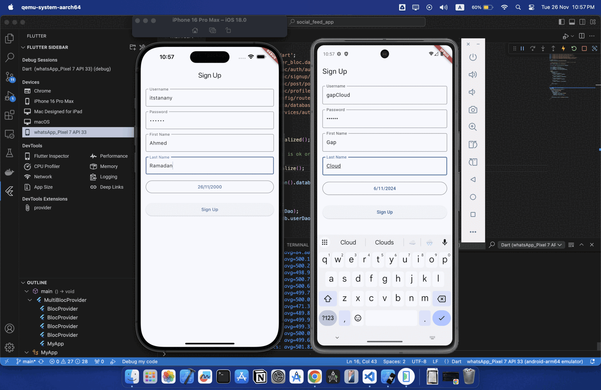

# Social Feed App

A Flutter social media application implementing MVC architecture with BLoC pattern for state management.



## Architecture Overview

### MVC + BLoC Pattern

The application follows MVC architecture with BLoC for state management:
- **Models/data**: Data entities and business logic
- **Views**: UI components and screens
- **Controllers**: Business logic and state coordination
- **BLoC**: Handles complex state management

## Project Structure
```
lib/
├── models/ # Data models
│          
├── views/
│   ├── screens/        # Main screens
│   │   ├── auth/       # Authentication screens
│   │   ├── feed/       # Feed management
│   │   └── profile/    # Profile screens
├── controllers/        # Business logic
|
├── data/
│   ├── database/       # Database configuration
│   └── dao/           # Data Access Objects
│   └── entities/      # Databse entities
|
├── services/          # Utility services
|
├── bloc/             # State management
|
└── config/           # App configuration
```


## Technical Stack

### Core Dependencies
- **Database**: [floor](https://pub.dev/packages/floor)
- **State Management**: [flutter_bloc](https://pub.dev/packages/flutter_bloc)
- **Navigation**: [go_router](https://pub.dev/packages/go_router)
- **Image Handling**: [cached_network_image](https://pub.dev/packages/cached_network_image)
- **Image Picker**: [image_picker](https://pub.dev/packages/image_picker)
- **Date Formatting**: [intl](https://pub.dev/packages/intl)

### Key Technical Decisions

#### Local Storage
- Floor for type-safe database operations
- Local image storage for performance
- Cached network images
- Fallback mechanisms for failed loads

#### Performance
- Image compression
- Efficient post sorting

#### Security
- Password hashing
- Input validation


The PostSortService implements three different sorting algorithms for posts:

## Recent Sort
- Sorts posts by creation date in descending order (newest first)
- Uses DateTime.parse to convert ISO8601 strings to DateTime objects
- Implements natural chronological ordering

## Popular Sort
- Sorts posts by number of likes in descending order
- Simple numerical comparison of likes count
- Focuses purely on engagement metrics

## Trending Sort
The most sophisticated algorithm that:
- Combines both likes and time factors
- Uses weighted scoring system:
  - LIKES_WEIGHT = 1.0
  - TIME_WEIGHT = 2.0
- Calculates engagement score using formula:
```
score = (likes * LIKES_WEIGHT) * (timeDecay * TIME_WEIGHT)
```

**Time Decay Factor**
- Calculated as: `1.0 / (1 + hoursDifference)`
- Decreases as post age increases
- Ensures newer posts with good engagement rank higher than older posts

This implementation:
- Maintains immutability by creating new lists
- Uses efficient sorting algorithms
- Provides flexible weighting system
- Balances recency and popularity


## Features

### Authentication
- Local authentication system
- Secure password handling
- Profile management
- Session persistence

### Feed Management
- Create, read, update, delete posts
- Image handling with local storage
- Like functionality with animations
- Post sorting (Recent, Popular, Trending)

### Profile Features
- Profile picture management
- User information updates
- Date handling and validation
- Image compression


## Getting Started

1. Clone the repository
2. Install dependencies:
```bash
flutter pub get
```

3. Run the app:
```bash
flutter run
```
